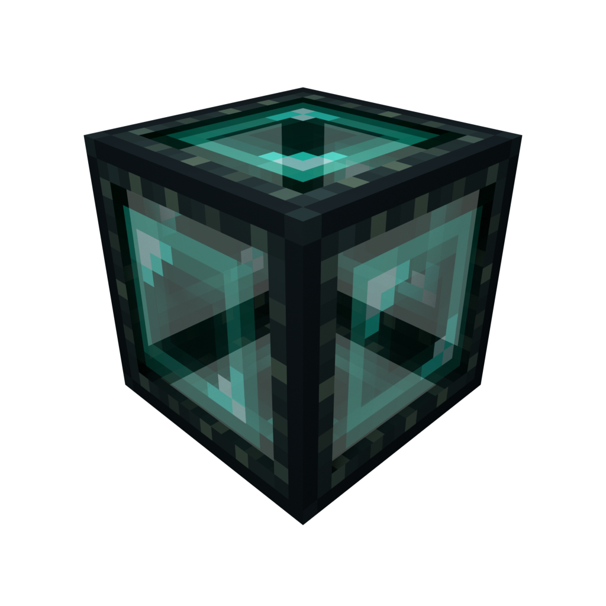

	

# Ender Box (Fabric)

A cardboard box on steroids, including a slightly more expensive recipe.

## Features

- Ender Box: a nice way to move blocks around while keeping their contents intact (heavily inspired by Mekanism cardboard box)
- Ender Boxer: automatically contains the block it's pointing at within an Ender Box while provided with a redstone signal.

## Remarks

The Ender Box not only serves to move around hard-to-move blocks like chests, but it also reduces lag when placed around machines that do a lot of processing every tick or are complex to render.

To that end, the Ender Boxer allows you to automate the process of boxing and unboxing blocks to reduce lag when unused and still remain available for use when needed.